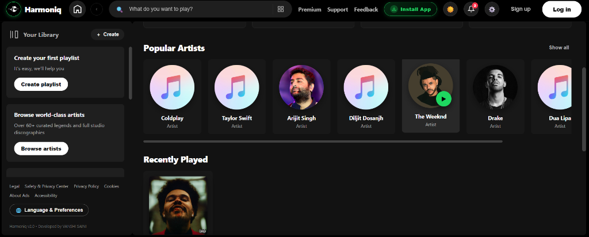

<div align="center">

# 🎵 Harmoniq

### Next-Generation Web Music Player & Progressive Web App (PWA)

[](https://reactjs.org/)
[](https://redux.js.org/)
[](https://styled-components.com/)
[](https://developer.mozilla.org/en-US/docs/Web/Progressive_web_apps)
[](LICENSE)
[](https://github.com/VANSHISAINI07)

<br />

**Harmoniq** is an ultra-sleek, responsive music streaming application engineered with React, Redux, and modern Web APIs. Inspired by the best of Apple Music and Spotify, Harmoniq delivers high-fidelity audio playback, seamless dual-channel crossfading, synchronized real-time lyrics, offline PWA capabilities, and instantaneous cross-device sharing.

[Explore Repository](https://github.com/VANSHISAINI07/harmoniq) • [Report Bug](https://github.com/VANSHISAINI07/harmoniq/issues) • [Request Feature](https://github.com/VANSHISAINI07/harmoniq/issues)

<br /><br />



<br />
<sub>Harmoniq v2.0 — Custom dark interface crafted with React, Redux, and high-fidelity streaming.</sub>

</div>

---

## 🌟 Key Highlights

### 🎧 High-Fidelity Audio & Worldwide Catalog
* **Global Search Engine:** Instant access to tens of millions of full-length tracks, albums, and artist discographies.
* **On-the-Fly Stream Decryption:** Integrated DES-ECB media decryption powered by `crypto-js` ensuring clean, uninterrupted streaming at up to 160kbps/320kbps fidelity.
* **Curated Discovery:** Handpicked top artists (Taylor Swift, The Weeknd, Diljit Dosanjh, Arijit Singh, Drake, Coldplay, and more) and trending global hit albums.

### 🎛️ Dual-Channel Smooth Mix (Apple Music-Style Crossfading)
* **True Gapless Blending:** Powered by a dual HTML5 `<audio>` engine that calculates real-time decibel curves to seamlessly blend the fading song into the upcoming track.
* **Customizable Duration:** Tailor crossfade timing (2s to 12s) to your taste via user preferences.
* **Zero Audio Jitter:** Prevents abrupt track cuts, providing a studio-grade listening experience.

### 🎤 Real-Time Synchronized Lyrics
* **LRCLIB Integration:** Automatically fetches synchronized time-stamped lyrics for currently playing songs.
* **Karaoke Mode:** Dynamic line-by-line highlight with smooth auto-scroll matching the exact vocal timeline.

### 📱 Progressive Web App (PWA) & Multi-Device Freedom
* **1-Click Native App Installation:** Add Harmoniq directly to your desktop, iPhone (via Safari Home Screen), or Android device with custom app branding and zero address bar clutter.
* **Lock-Screen & Headphone Controls:** Native browser `MediaSession` API support for background playback, track artwork, scrubbing, and physical media key integration.
* **Direct LAN Mode:** Stream directly on your home Wi-Fi (`192.168.x.x`) with 0ms server latency and no internet tunnels required.
* **Universal Cloud Tunnel:** Integrated auto-healing tunnel runner with dynamic QR code generation for quick testing on 4G/5G mobile networks.

### 📝 Personal Track Notes & Memorabilia
* Write and persist personal memos, journal entries, or memory notes attached to any song.
* Visual note indicators (`NoteActiveDot`) highlight songs that hold your thoughts.

---

## 🛠️ Architecture & Tech Stack

| Domain | Technologies |
| :--- | :--- |
| **Frontend Framework** | React 16 (Component Lifecycle, Portals, Error Boundaries) |
| **State Architecture** | Redux + Redux-Thunk (Centralized player state, queue, themes, user preferences) |
| **Styling & Animation** | Styled-Components (CSS-in-JS), Fluid Keyframe Transitions, Custom Scrollbars |
| **Media & Audio Engine** | Dual HTML5 Audio Channel System, Web Audio Volume Curves, Web MediaSession API |
| **Security & Decryption** | CryptoJS (DES-ECB audio deciphering, cryptographic stream verification) |
| **Networking & Proxy** | Express Dev Proxy (`setupProxy.js`), Fetch API, Dynamic Network Detection |
| **Connectivity & QR** | LocalTunnel Daemon, Dynamic QR Code Generator (`qrcode`), LAN Auto-Discovery |

---

## 📂 Project Organization

```text
harmoniq/
├── public/
│   ├── images/              # App branding, UI icons, and default artwork
│   ├── favicon.ico          # Web app icon
│   ├── manifest.json        # PWA configuration manifest
│   └── index.html           # HTML template
├── src/
│   ├── js/
│   │   ├── audio/           # Redux actions & reducers for playback engine
│   │   ├── components/      # UI components (SpotifyPlayerBar, Lyrics, Modals)
│   │   │   ├── install/     # Multi-device PWA onboarding & QR modal
│   │   │   ├── lyrics/      # Synchronized LRC lyrics renderer
│   │   │   ├── notes/       # Song notes & personal memorabilia modal
│   │   │   ├── preferences/ # Audio preferences (Smooth Mix, crossfade duration)
│   │   │   └── spotify/     # Modern responsive navigation, player bar & cards
│   │   ├── services/        # Audio search & JioSaavn stream decryptor service
│   │   ├── theme/           # Dark / Light Spotify-styled themes
│   │   └── rootReducer.js   # Master Redux state tree
│   ├── setupProxy.js        # High-performance API proxy & network diagnostics
│   ├── App.js               # Root component & global styling
│   └── index.js             # React DOM bootstrap
├── tunnel-runner.js         # Auto-reconnecting cloud tunnel daemon
├── package.json             # NPM dependencies & operational scripts
└── README.md                # Project documentation
```

---

## 🚀 Getting Started

### Prerequisites
* **Node.js** (v16.x or later recommended; Node v18+ supported via OpenSSL legacy provider)
* **npm** (v7.x or later) or **yarn**

### Installation

1. **Clone the repository:**
   ```bash
   git clone https://github.com/VANSHISAINI07/harmoniq.git
   cd harmoniq
   ```

2. **Install project dependencies:**
   ```bash
   npm install
   ```

3. **Launch the development server:**
   ```bash
   npm start
   ```
   Harmoniq will start locally and open at **[http://localhost:3000](http://localhost:3000)**.

---

## 📲 Testing on Mobile Devices

Harmoniq makes testing on smartphones seamless without deploying to external cloud platforms:

### 1. Same Home Wi-Fi (Direct LAN)
* Ensure your phone is connected to the same Wi-Fi network as your PC.
* Open Harmoniq on your PC, click **Install Harmoniq**, and select the **Local Wi-Fi** tab.
* Scan the displayed QR code or navigate directly to `http://<YOUR_LOCAL_IP>:3000`.

### 2. Anywhere in the World (Cloud Tunnel)
* Start the background tunnel runner:
  ```bash
  node tunnel-runner.js
  ```
* Open the **Cloud Link** tab in the app's install modal to view your live public tunnel URL and QR code.

---

## ⌨️ Available Scripts

| Command | Description |
| :--- | :--- |
| `npm start` | Starts the React development server on port 3000 with hot reloading. |
| `npm run build` | Compiles an optimized, minified production build into the `build/` folder. |
| `npm test` | Launches the interactive test runner via Jest. |
| `node tunnel-runner.js` | Starts the resilient cloud tunnel daemon for remote device testing. |

---

## 👤 Author & Architecture

Designed and engineered with passion by:

**VANSHI SAINI**  
* **GitHub:** [@VANSHISAINI07](https://github.com/VANSHISAINI07)  
* **Role:** Lead Architect & Developer  

---

## 📄 License

This project is licensed under the terms of the [MIT License](LICENSE).

---

<div align="center">
  <sub>Built with ❤️ by VANSHI SAINI • Harmoniq © 2026. All rights reserved.</sub>
</div>
